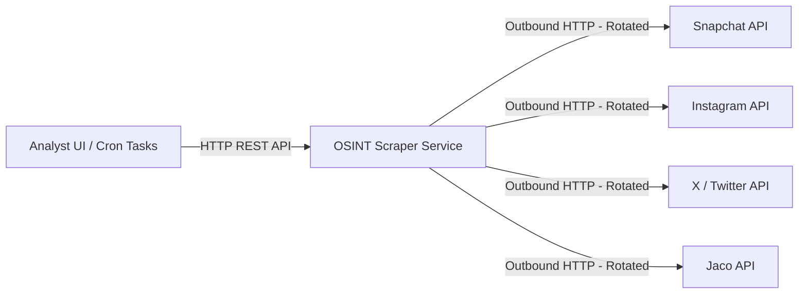
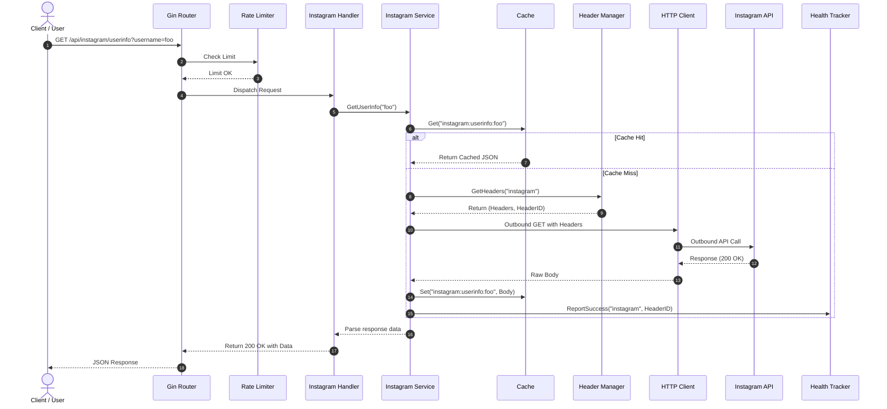
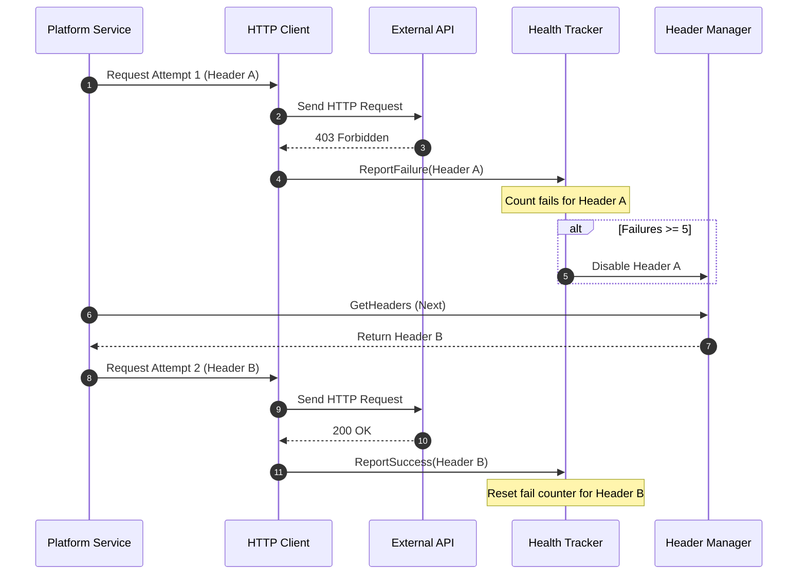
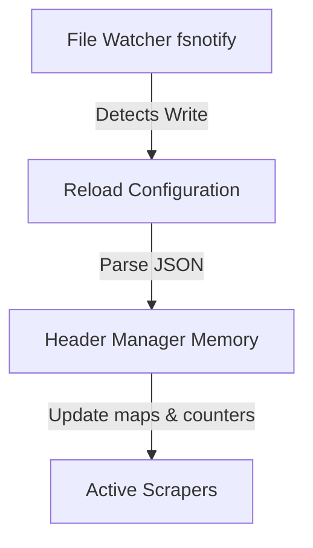

# High-Level Design (HLD) — OSINT Scraper REST API

This document describes the high-level architecture, subsystem boundaries, data flows, and infrastructure models for the OSINT Scraper service.

---

## 1. System Context & Boundaries

The OSINT Scraper acts as a specialized proxy and API layer between internal analysis tools (threat intelligence platforms, investigation UIs) and target social media platforms. It abstracts away session management, header rotation, rate-limiting bypasses, and scraping mechanics.



---

## 2. High-Level Subsystems

The service is divided into three primary layers:

```
┌────────────────────────────────────────────────────────┐
│                      API Layer                         │
│ - Gin HTTP Router & Middleware (Rate limit, CORS, Auth)│
│ - Swagger UI Specs                                     │
└──────────────────────────┬─────────────────────────────┘
                           │
                           ▼
┌────────────────────────────────────────────────────────┐
│                   Registry Layer                       │
│ - Dynamic route registration & Discovery               │
└──────────────────────────┬─────────────────────────────┘
                           │
                           ▼
┌────────────────────────────────────────────────────────┐
│                   Platform Engines                     │
│ - Snapchat, Instagram, X, Jaco, Telegram Services      │
└──────────────────────────┬─────────────────────────────┘
                           │
                           ▼
┌────────────────────────────────────────────────────────┐
│                   Core Client Engine                   │
│ - Session Wrapper, Cache, Header Rotation & Watcher    │
└────────────────────────────────────────────────────────┘
```

1. **API Layer**: Handles incoming HTTP requests, CORS, rate limiting, Swagger spec generation, and overall lifecycle.
2. **Platform Registry Layer**: Discovers available scrapers, mounts their routes dynamically, and exposes health state.
3. **Platform Engines**: Implement platform-specific parsing, query parameters, API endpoints, and payload formats.
4. **Core Client Engine**: Provides shared services for HTTP sessions, cookie storage, in-memory caching, header file watching, and automated rotation.

---

## 3. Core Architecture Flows

### 3.1 Scraper Request Flow
The following sequence diagram demonstrates the flow of a standard user request (e.g., retrieving Instagram user info):



### 3.2 Header Rotation & Error Handling Flow
When a platform request encounters failures (e.g., rate-limiting `429` or forbidden `403` responses), the system automatically retries with a new header set and reports failures:



### 3.3 Dynamic Configuration Reloading
The Header Manager watches `config/headers.json` on disk. When edited (e.g., via the Admin API or direct Kubernetes mount updates), the watcher reloads it into memory without server restarts.



---

## 4. Infrastructure & Deployment Model

The microservice is designed for containerized deployment in Kubernetes.

* **ConfigMap / PersistentVolume Mounts**: The active `headers.json` file is mounted into the container at `/config/headers.json`. Using a `PersistentVolumeClaim` allows read/write access so the Admin API can persist runtime header modifications.
* **Graceful Shutdown**: Upon receiving `SIGINT` or `SIGTERM`, the Gin server stops accepting new connections and waits for active requests to finish (with a 10-second timeout) before cleaning up the cache and shutting down.
